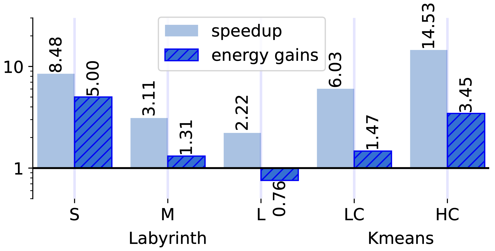

# PIM STM

Processing-In-Memory (PIM) is a novel approach that augments existing DRAM memory chips with lightweight logic. By allowing to offload computations to the PIM system, this architecture allows for circumventing the data-bottleneck problem that affects many modern workloads.

This work tackles the problem of how to build efficient software implementations of the Transactional Memory  (TM) abstraction by introducing PIM-STM, a library that provides a range of diverse TM implementations  for  UPMEM, the first commercial PIM system. Via an extensive study we  assess the efficiency of alternative choices in the design space of TM algorithms on this emerging  architecture. We further quantify the impact of using different memory tiers of the UPMEM system (having different trade-offs for what concerns latency vs capacity) to store the  metadata used by  different TM implementations. Finally, we assess the gains achievable in terms of performance and memory efficiency when using PIM-STM to accelerate TM applications originally conceived for conventional CPU-based systems.

<p align="center">

</p>

You can find the extended version of the paper on arXiv - https://arxiv.org/abs/2401.09281.

## Available Backends

This library includes several backends (software transactional memory implementations). Each benchmark can be executed using all of the following backends.

* norec - for the STM NOrec
* rwlocks_wbctl - for the STM Read-Write Locks with write-back and commit-time locking
* rwlocks_wbetl - for the STM Read-Write Locks with write-back and encounter-time locking
* rwlocks_wtetl - for the STM Read-Write Locks with write-through and encounter-time locking
* tiny_wbctl - for the STM TinySTM with write-back and commit-time locking
* tiny_wbetl - for the STM TinySTM with write-back and encounter-time locking
* tiny_wtetl - for the STM TinySTM with write-through and encounter-time locking

## Building and running the benchmarks

The code in this library must be run on the UPMEM hardware. For more information visit https://sdk.upmem.com/2023.2.0/.

The benchmarks can be compiled and executed with the following commands:

### ArrayBench
``` bash
./build.sh [backend] bank [num accounts] [num tasklets]
./Bank/bin/host
```

### Linked-List
``` bash
./build.sh [backend] linkedlist [percent update transactions] [num tasklets]
./LinkedList/bin/host
```

### Kmeans
``` bash
./build.sh [backend] kmeans [num clusters] [num tasklets]
./Kmeans/bin/host
```

### Labyrinth
``` bash
./build.sh [backend] labyrinth 0 [num tasklets]
./Labyrinth/bin/host 
```

For questions contact the author: André Lopes - andre.f.lopes@tecnico.ulisboa.pt

When using this work, please cite accordingly:

André Lopes, Daniel Castro, and Paolo Romano. "PIM-STM: Software Transactional Memory for Processing-In-Memory Systems". Proceedings of the 29th ACM International Conference on Architectural Support for Programming Languages and Operating Systems, Volume 2. 2024.

This work was supported by national funds through FCT, Fundação para a Ciência e a Tecnologia, under project UIDB/50021/2020 (DOI:10.54499/UIDB/50021/2020) and via IAPMEI under project C645008882-00000055.PRR (NextGenerationEU/EU Recovery and Resilience Plan).